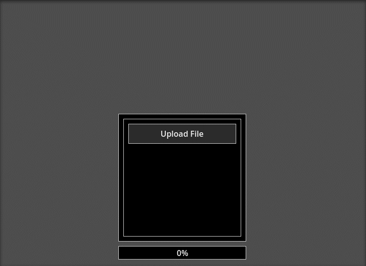

## Godot File Access Web
Addon for uploading files in HTML5 on Godot 4.

## Example
<p align="center">
  
</p>

<p align="center">
  (from <a href="/addons/FileAccessWeb/examples/upload_image_example.gd">upload image example</a>.)
</p>

## Usage

> **Important!** FileAccessWeb working only for HTML5 (web) export! Please check your project settings before use. In other cases, the addon does not work and push errors when using it.

Create `FileAccessWeb` object and open input dialog window:

```gdscript
var file_access_web := FileAccessWeb.new()
file_access_web.open()
```

You can pass accept files types as arguments to the open method:

```gdscript
# use file extension for it:
file_acces_web.open(".jpg")
file_acces_web.open(".png")

# or web things:
file_acces_web.open("image/png")

# combine file types separated by commas:
file_acces_web.open(".jpg, .png")
```

To receive the uploaded file, you must connect to loaded signal:

```gdscript
var file_access_web := FileAccessWeb.new()

func _ready() -> void:
  file_access_web.loaded.connect(on_file_loaded)
  file_access_web.open(".jpg")

func _on_file_loaded(file_name: String, file_type: String, base64_data: String) -> void:
  # do something...
```

There is a signal to track the upload progress:

```gdscript
var file_access_web := FileAccessWeb.new()

func _ready() -> void:
  file_access_web.progress.connect(_on_progress)
  file_access_web.open(".jpg")

func _on_progress(current_bytes: int, total_bytes: int) -> void:
  # do something...
```

A detailed example can be found in [upload image example](/addons/FileAccessWeb/examples/upload_image_example.gd) or [upload file example](/addons/FileAccessWeb/examples/upload_file_example.gd).
